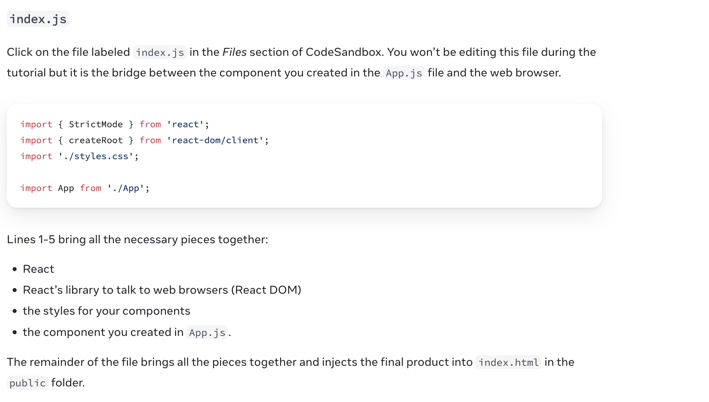
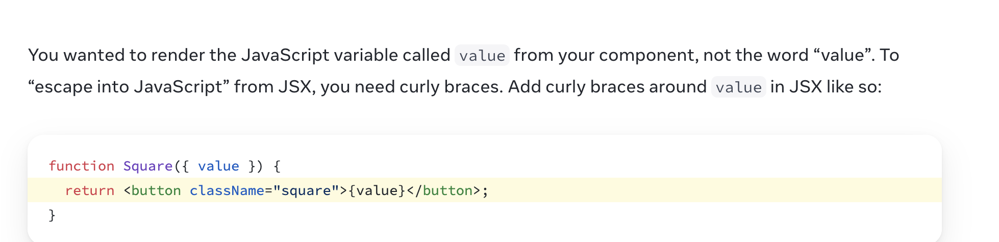

# 教程：井字棋游戏
https://zh-hans.react.dev/learn/tutorial-tic-tac-toe

App.js 的代码创建了一个 组件。在 React 中，组件是一段可重用代码，它通常作为 UI 界面的一部分。组件用于渲染、管理和更新应用中的 UI 元素。让我们逐行查看这段代码，看看发生了什么：
/The code in App.js creates a component. In React, a component is a piece of reusable code that represents a part of a user interface. Components are used to render, manage, and update the UI elements in your application. Let’s look at the component line by line to see what’s going on:

export default function Square() {
  return <button className="square">X</button>;
}

The code in App.js creates a component. In React, a component is a piece of reusable code that represents a part of a user interface. Components are used to render, manage, and update the UI elements in your application. Let's look at the component line by line to see what's going on:
//
The first line defines a function called Square. The export JavaScript keyword makes this function accessible outside of this file. The default keyword tells other files using your code that it’s the main function in your file.

The first line defines a function called Square.The export JavaScript keyword makes this function accessible outside of this file. The default keyword tells other files using your code that it's the main function in your file.

第二行返回一个按钮。JavaScript 的 return 关键字意味着后面的内容都作为值返回给函数的调用者。<button> 是一个 JSX 元素。JSX 元素是 JavaScript 代码和 HTML 标签的组合，用于描述要显示的内容。className="square" 是一个 button 属性，它决定 CSS 如何设置按钮的样式。X 是按钮内显示的文本，</button> 闭合 JSX 元素以表示不应将任何后续内容放置在按钮内

The second line returns a button. The return JavaScript keyword means whatever comes after is returned as a value to the caller of the function. <button> is a JSX element. A JSX element is a combination of JavaScript code and HTML tags that describes what you’d like to display. className="square" is a button property or prop that tells CSS how to style the button. X is the text displayed inside of the button and </button> closes the JSX element to indicate that any following content shouldn’t be placed inside the button.

The second line returns a button . The return JavaScript keyword means whatever comes after is returned as a value to the caller of the function.<button> is a JSX element. A jSX element is a combination of JavaScript code and HTML tags that describes what you'd like to display. className="square" is a button property or prop that tells CSS how to style the button. X is the text displayed inside of the button and </button> closes the JSX element to indicate that any following content shouldn't be placed inside the button.

index.js 
单击 CodeSandbox 中的 index.js 的文件。在本教程中我们不会编辑此文件，但它是 App.js 文件中创建的组件与 Web 浏览器之间的桥梁。

import { StrictMode } from 'react';
import { createRoot } from 'react-dom/client';
import './styles.css';

import App from './App';
第 1-5 行将所有必要的部分组合在一起：

React
React 与 Web 浏览器对话的库（React DOM）
组件的样式
App.js 里面创建的组件
其他文件将它们组合在一起，并将最终成果注入 public 文件夹里面的 index.html 中。
//
index.js

Click on the file labeled index.js in the Files section of CodeSandbox. You won't be editing this file during the tutorial but it is the bridge  between the component you created in the APP.js file and the web browser.

index.js 
Click on the file labeled index.js in the Files section of CodeSandbox. You won’t be editing this file during the tutorial but it is the bridge between the component you created in the App.js file and the web browser.

import { StrictMode } from 'react';
import { createRoot } from 'react-dom/client';
import './styles.css';

import App from './App';
Lines 1-5 bring all the necessary pieces together:

React
React’s library to talk to web browsers (React DOM)
the styles for your components
the component you created in App.js.
The remainder of the file brings all the pieces together and injects the final product into index.html in the public folder.

import App from './App';
Lines 1-5 bring all the necessary pieces together:
React 
React's library to talk to web browsers (React DOM)
the styles for your components
the component you created in App.js.
The remainder of the file brings all the pieces together and injects the final product into index.html in the public folder.

!!
React components need to return a single JSX element and not multiple adjacent JSX elements like two buttons. To fix this you can use Fragments (<> and </>) to wrap multiple adjacent JSX elements like this:

React components need to return a single JSX element and not multiple adjacent JSX elements like two buttons. To fix this you can use Fragments(<> and </>) to wrap multiple adjacent  JSX elements like this:
Oh no! The squares are all in a single line, not in a grid like you need for our board. To fix this you’ll need to group your squares into rows with divs and add some CSS classes. While you’re at it, you’ll give each square a number to make sure you know where each square is displayed.

The squared are all in a single line, not in a grid like you need for our board. To fix this you'll need to group your squares into rows with divs and add some CSS classed. While you're at it, you'll give each square a number to make sure 
you know where each square is displayed.

Psssst… That’s a lot to type! It’s okay to copy and paste code from this page. However, if you’re up for a little challenge, we recommend only copying code that you’ve manually typed at least once yourself.
// That's a lot to type! It's okay to copy and paste code from this page. However, if you're up for a little challenge,
we recommend only copying code that you've manually typed at least once yourself.

Passing data through props

Instead of copy-pasting, React’s component architecture allows you to create a reusable component to avoid messy, duplicated code.

Instead of copy-pasting, React's component architecture allows you to create a reusable component to avoid messy, duplicated code.

You wanted to render the JavaScript variable called value from your component, not the word “value”. To “escape into JavaScript” from JSX, you need curly braces. Add curly braces around value in JSX like so:

You wanted to render the JavaScript vari

This is because the Board component hasn’t passed the value prop to each Square component it renders yet. To fix it you’ll add the value prop to each Square component rendered by the Board component:
//
This is because the Board component hasn't passed the value prop  to each Square component it renders yet. To fix it you'll add the value prop to each Square component rendered by the Board component:

## Making an interactive component 
Let’s fill the Square component with an X when you click it. Declare a function called handleClick inside of the Square. Then, add onClick to the props of the button JSX element returned from the Square:

React provides a special function called useState that you can call from your component to let it “remember” things. Let’s store the current value of the Square in state, and change it when the Square is clicked.

Import useState at the top of the file. Remove the value prop from the Square component. Instead, add a new line at the start of the Square that calls useState. Have it return a state variable called value:

React provides a special function  called useState that you can all from your component to let it "remember" things. Let's store the current value of the Square in state, and change it when the Square is clicked.

value stores the value and setValue is a function that can be used to change the value. The null passed to useState is used as the initial value for this state variable, so value here starts off equal to null.

Since the Square component no longer accepts props anymore, you’ll remove the value prop from all nine of the Square components created by the Board component:
、、
？？
// Value stores the value and setValue is a function that can be used to change the value. The null passed to useState is used as the initial value for this state variable, so value here starts off equal to null.

By calling this set function from an onClick handler, you’re telling React to re-render that Square whenever its <button> is clicked. After the update, the Square’s value will be 'X', so you’ll see the “X” on the game board. Click on any Square, and “X” should show up:

// By calling this set function from an onClick handler ,you're telling React to re-render that Square whenever its<button>si
clicked. After the update, the Square's value will be 'X', so you'll see the "X" on the game board. Click on any Square, and "X" should show up:

For local development, React DevTools is available as a Chrome, Firefox, and Edge browser extension. Install it, and the Components tab will appear in your browser Developer Tools for sites using React.
//
For local development, React DevTools is available as a Chrome, Firefox, and Edge browser extension. Install it, and the Components tab will appear in your brwoser Developer Tools for sites using React/

、、//
Completing the game 
By this point, you have all the basic building blocks for your tic-tac-toe game. To have a complete game, you now need to alternate placing “X”s and “O”s on the board, and you need a way to determine a winner.

Completing the game
By this point, you have all the basic building blocks for your tic-tac-toe game. To have a complete game, you now need to alternate placing "X"s and "O"s on the board, and you need a way to determine a winner.
// To collect data from multiple children, or to have two child components communicate with each other, declare the shared state in their parent component instead. The parent component can pass that state back down to the children via props. This keeps the child components in sync with each other and with their parent.
To collect date from multiple children ,or to have two child components communicate with each other, declare the shared state in their parent component instead.The parent component can paas that 

Now that your state handling is in the Board component, the parent Board component passes props to the child Square components so that they can be displayed correctly. When clicking on a Square, the child Square component now asks the parent Board component to update the state of the board. When the Board’s state changes, both the Board component and every child Square re-renders automatically. Keeping the state of all squares in the Board component will allow it to determine the winner in the future.
//

Now that your state handling is in the Board component, the parent Board component passes props to the child Square components so that they can be displayed correctly. When clicking on a Square, the child Square component now asks the parent Board component to update the state of the board.When the Board's state changes, both the Board component and every child Square re-renders automatically. Keeping the state of all squares in the Board component will allow it to determine the winner in the future.

The DOM <button> element’s onClick attribute has a special meaning to React because it is a built-in component. For custom components like Square, the naming is up to you. You could give any name to the Square’s onSquareClick prop or Board’s handleClick function, and the code would work the same. In React, it’s conventional to use onSomething names for props which represent events and handleSomething for the function definitions which handle those events.

The DOM <button> element's onClick attribute has a special meaning to React because it is a built-in component. For custom components like Square, the naming is up to you. You could give any name to the Square's onSquareClick prop
or Board's handleClick function, and the code would work the same. In React, it's conventional to use onSomething 
names for props which represent events and handleSomething for the function definitions which handle those events.

// It does not matter whether you define calculateWinner before or after the Board. Let’s put it at the end so that you don’t have to scroll past it every time you edit your components.

It does not matter whether you define calculateWinner before or after the Board. Let's put it at the end so that you don't have to scroll past it every time you edit your components.
//
Adding time travel 
As a final exercise, let’s make it possible to “go back in time” to the previous moves in the game.

Adding time travel 
As a final exercise, let's make it possible to "go back in time " to the previous moves in the game.

## Storing a history of moves 
If you mutated the squares array, implementing time travel would be very difficult.

However, you used slice() to create a new copy of the squares array after every move, and treated it as immutable. This will allow you to store every past version of the squares array, and navigate between the turns that have already happened.

You’ll store the past squares arrays in another array called history, which you’ll store as a new state variable. The history array represents all board states, from the first to the last move, and has a shape like this:

//Note that you are removing the export default keywords before the function Board() { declaration and adding them before the function Game() { declaration. This tells your index.js file to use the Game component as the top-level component instead of your Board component. The additional divs returned by the Game component are making room for the game information you’ll add to the board later.

Note that you are removing the export default keywords before the function Board(){declaration and adding them before the function Game(){ decalaration. This tells your index.js file to use the Game component as the top-level component instead of your Board component. The additional divs returned by the Game component are making room for the game information you'll add to the board later.
}